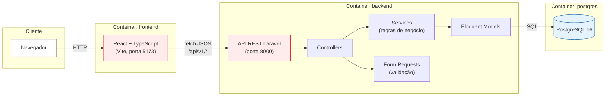

# FluxSaúde

Aplicação full stack para registro e acompanhamento de solicitações de atendimento em unidades públicas de saúde. Desenvolvida como desafio técnico para seleção do V-Lab/CIn-UFPE.

Permite criar, consultar, filtrar e atualizar solicitações de atendimento, com frontend e backend desacoplados por uma API REST.

## Índice

- [Tecnologias utilizadas](#tecnologias-utilizadas)
- [Como executar](#como-executar)
- [Arquitetura e decisões técnicas](#arquitetura-e-decisões-técnicas)
- [Backend](#backend)
- [Frontend](#frontend)
- [Banco de dados](#banco-de-dados)
- [Testes](#testes)
- [Integração contínua](#integração-contínua)
- [Especificação da API](#especificação-da-api)
- [Funcionalidades implementadas](#funcionalidades-implementadas)
- [Limitações conhecidas](#limitações-conhecidas)
- [Uso de inteligência artificial](#uso-de-inteligência-artificial)

---

## Tecnologias utilizadas

| Camada | Tecnologia | Versão |
|---|---|---|
| Frontend | React + TypeScript (Vite) | React 19, TypeScript 5, Vite 8 |
| Roteamento | React Router | 6 |
| Backend | PHP + Laravel | PHP 8.4, Laravel 13 |
| Banco de dados | PostgreSQL | 16 |
| Infraestrutura | Docker + Docker Compose | — |
| Testes backend | PHPUnit | — |
| Testes frontend | Vitest + React Testing Library | — |
| CI | GitHub Actions | — |

## Como executar

### Pré-requisitos

- Docker e Docker Compose instalados

### Passos

1. Clone o repositório e entre na pasta raiz do projeto.

2. Crie o arquivo `.env` na raiz (mesma pasta do `docker-compose.yml`):
```bash
   cp .env.example .env
```

3. Crie o `.env` do backend:
```bash
   cp backend/.env.example backend/.env
```
   Gere a chave da aplicação (necessária para o Laravel funcionar):
```bash
   docker compose run --rm backend php artisan key:generate
```
   > Alternativamente, se tiver PHP/Composer instalados localmente, pode rodar `php artisan key:generate` fora do container antes do primeiro `up`.

4. Crie o `.env` do frontend:
```bash
   cp frontend/.env.example frontend/.env
```

5. Suba o ambiente completo:
```bash
   docker compose up --build
```

Isso sobe três serviços:
- **PostgreSQL** na porta `5432`
- **Backend (Laravel)** na porta `8000` — roda migrations automaticamente e popula dados fictícios na primeira inicialização (banco vazio)
- **Frontend (React + Vite)** na porta `5173`

6. Acesse a aplicação em [http://localhost:5173](http://localhost:5173).

A API fica disponível em `http://localhost:8000/api/v1`.

### Repopular dados fictícios manualmente (opcional)

O seeder só popula automaticamente quando a tabela está vazia. Para forçar a execução manual (ela não duplica dados se a tabela já tiver registros):
```bash
docker compose exec backend php artisan db:seed
```

## Arquitetura e decisões técnicas



**Limites entre as camadas:**
- O **frontend** nunca acessa o banco diretamente — toda comunicação passa pela API REST em JSON.
- O **Controller** não concentra regras de negócio: valida via Form Request e delega a lógica de transição de status ao `SolicitacaoStatusService`.
- O **Model** (Eloquent) é a única camada que fala com o PostgreSQL.

**Evolução possível:** se o domínio crescesse (por exemplo, adicionando outros tipos de solicitação além de saúde, ou integrações com sistemas externos das unidades), o `SolicitacaoStatusService` poderia evoluir para um pacote de domínio próprio, e novos bounded contexts (ex: `Agendamento`, `Notificacao`) poderiam ser extraídos como módulos ou até serviços separados, comunicando-se via eventos em vez de chamadas diretas — mantendo o Controller como a única porta de entrada HTTP de cada módulo.

- **Frontend e backend desacoplados**, comunicando-se exclusivamente via API REST (JSON), sem dependência de dados estáticos como fonte de dados no frontend.
- **Containers isolados** para cada camada (frontend, backend, banco), orquestrados via Docker Compose, com rede interna compartilhada. O backend acessa o banco pelo nome do serviço (`postgres`), nunca por IP fixo.
- **Configuração via variáveis de ambiente** em todas as camadas, com arquivos `.env.example` versionados (sem segredos reais) e `.env` reais fora do controle de versão.
- **Regras de negócio centralizadas fora do Controller**: a lógica de transição de status vive em `SolicitacaoStatusService`, não no Controller, para manter o Controller magro e a regra testável isoladamente.
- **Validação via Form Requests** do Laravel (`StoreSolicitacaoRequest`, `UpdateStatusSolicitacaoRequest`), incluindo uma regra condicional customizada (justificativa obrigatória apenas quando prioridade é `URGENTE`).
- **Tratamento de exceções centralizado** em `bootstrap/app.php`: respostas de erro da API são sempre JSON, com mensagens claras e sem exposição de detalhes internos (stack traces), independente de `APP_DEBUG`.
- **Protocolo único gerado automaticamente** no Model via evento `creating`, sem depender do frontend ou de input do usuário.

---

## Backend

### Stack
PHP 8.4 + Laravel 13 + PostgreSQL 16, containerizado com Docker.

### Funcionalidades obrigatórias implementadas

- API REST com os 4 endpoints exigidos pelo edital:
  - `POST /api/v1/solicitacoes` — criação
  - `GET /api/v1/solicitacoes` — listagem paginada com filtros por `status`, `categoria` e `prioridade`
  - `GET /api/v1/solicitacoes/{id}` — detalhe
  - `PATCH /api/v1/solicitacoes/{id}/status` — atualização de status
- Modelo de dados completo conforme especificado: `id`, `protocolo` (único, gerado automaticamente), `nome_solicitante`, `categoria`, `prioridade`, `status`, `descricao`, `justificativa_prioridade`, `data_criacao`, `data_atualizacao`.
- Regras de negócio obrigatórias:
  - Toda solicitação criada com status inicial `RECEBIDA`.
  - Protocolo único gerado automaticamente pela aplicação.
  - Justificativa de prioridade obrigatória quando `prioridade = URGENTE` (validada via Form Request).
  - `data_criacao` gerada automaticamente; `data_atualizacao` atualizada a cada modificação.
  - Fluxo de transição de status respeitado e centralizado em `SolicitacaoStatusService`: `RECEBIDA → EM_ANALISE/CANCELADA → AGENDADA/CANCELADA → CONCLUIDA/CANCELADA`, com `CONCLUIDA` e `CANCELADA` como estados finais.
  - Requisições inválidas retornam mensagens de erro claras com códigos HTTP adequados (422 para validação, 404 para não encontrado, 500 para erro genérico — todos em JSON, sem stack trace).
- Validação rigorosa via Form Requests (`StoreSolicitacaoRequest`, `UpdateStatusSolicitacaoRequest`), evitando lógica de validação no Controller.
- Persistência via Eloquent, com migrations versionadas do Laravel (sem alterações manuais no banco).
- Migrations executadas automaticamente na inicialização do ambiente via `entrypoint.sh`.

### Funcionalidades adicionais (diferenciais)

- **Health check** (`GET /api/health`): verifica o funcionamento da API e a conectividade com o PostgreSQL, retornando `200` quando saudável ou `503` quando o banco está indisponível.
- **Endpoint de resumo** (`GET /api/v1/solicitacoes/resumo`): agrega contagens por status e prioridade via `GROUP BY` no banco, usado pelo dashboard do frontend.
- **Seeder + Factory** (`SolicitacaoSeeder`, `SolicitacaoFactory`) para dados fictícios, executado automaticamente na inicialização apenas quando o banco está vazio (idempotente).
- **Tratamento de exceções centralizado**, com handlers específicos por tipo de erro (`ModelNotFoundException`, `NotFoundHttpException`, `ValidationException`, genérico), sempre respondendo em JSON.
- Índice composto em `status`, `categoria`, `prioridade` para otimizar os filtros da listagem.

### Estrutura de pastas relevante

backend/
├── app/
│ ├── Http/
│ │ ├── Controllers/Api/
│ │ │ ├── SolicitacaoController.php
│ │ │ └── HealthController.php
│ │ └── Requests/
│ │ ├── StoreSolicitacaoRequest.php
│ │ └── UpdateStatusSolicitacaoRequest.php
│ ├── Models/Solicitacao.php
│ └── Services/SolicitacaoStatusService.php
├── database/
│ ├── factories/SolicitacaoFactory.php
│ ├── migrations/..._create_solicitacoes_table.php
│ └── seeders/SolicitacaoSeeder.php
├── routes/api.php
├── tests/Unit/SolicitacaoStatusServiceTest.php
└── entrypoint.sh


---

## Frontend

### Stack
React 19 + TypeScript + Vite, com React Router para navegação.

### Funcionalidades obrigatórias implementadas

- **Tela inicial** com resumo das solicitações por status (cards com contagem), consumindo o endpoint de resumo do backend.
- **Listagem paginada** das solicitações.
- **Filtros** por status, categoria e prioridade.
- **Formulário de criação** com validação de campos, incluindo exibição condicional e obrigatoriedade do campo de justificativa quando a prioridade selecionada é `URGENTE`.
- **Visualização de detalhes** de uma solicitação individual.
- **Ação de atualização de status**, exibindo apenas as transições permitidas para o status atual (consistente com a regra de negócio do backend).
- **Estados visuais** de carregamento, sucesso, vazio e erro em todas as telas que consomem a API.
- Interface implementada em React com TypeScript, tipagem completa do contrato com a API (sem uso de `any`), layout responsivo e navegação por rotas nomeadas.

### Funcionalidades adicionais (diferenciais)

- **Identidade visual própria** (paleta vermelho/branco, inspirada em aplicações de saúde pública como o Hemovida), com CSS organizado por componente/tela em vez de estilos inline.
- **Cliente HTTP centralizado** (`services/api.ts`) com tratamento de erro tipado (`ApiRequestError`), evitando duplicação de lógica de fetch em cada tela.
- **Testes automatizados** com Vitest + React Testing Library cobrindo a regra de exibição condicional do campo de justificativa.

### Estrutura de pastas relevante

frontend/src/
├── components/ResumoSolicitacoes.tsx # cards de resumo por status
├── pages/
│ ├── ListaSolicitacoes.tsx
│ ├── NovaSolicitacao.tsx
│ ├── NovaSolicitacao.test.tsx
│ └── DetalheSolicitacao.tsx
├── services/api.ts # cliente HTTP centralizado
└── types/solicitacao.ts # contratos TypeScript com a API


---

## Banco de dados

### Stack
PostgreSQL 16, versionado exclusivamente por migrations do Laravel.

### Modelagem

Tabela única `solicitacoes`, modelada de forma relacional e coerente com o domínio:

| Coluna | Tipo | Restrição |
|---|---|---|
| `id` | bigint | chave primária |
| `protocolo` | string | único, obrigatório |
| `nome_solicitante` | string | obrigatório |
| `categoria` | enum | `CONSULTA`, `EXAME`, `VACINACAO`, `OUTRO` |
| `prioridade` | enum | `BAIXA`, `MEDIA`, `ALTA`, `URGENTE` |
| `status` | enum | `RECEBIDA`, `EM_ANALISE`, `AGENDADA`, `CONCLUIDA`, `CANCELADA` (default `RECEBIDA`) |
| `descricao` | text | obrigatório |
| `justificativa_prioridade` | text | opcional (obrigatório apenas quando prioridade = `URGENTE`, validado na aplicação) |
| `data_criacao` | timestamp | gerado automaticamente |
| `data_atualizacao` | timestamp | atualizado automaticamente a cada modificação |

**Índice composto** em (`status`, `categoria`, `prioridade`) para otimizar os filtros expostos pela API.

### Decisões

- Campos `categoria`, `prioridade` e `status` modelados como `enum` nativo do PostgreSQL (via Laravel), garantindo integridade de domínio diretamente no banco, além da validação na camada de aplicação.
- `protocolo` com constraint `unique`, garantindo unicidade mesmo sob concorrência (não depende apenas de checagem na aplicação).
- Persistência isolada em container próprio, com volume nomeado (`postgres_data`) para persistir dados entre reinicializações do container.
- Schema criado e alterado exclusivamente via migrations versionadas — nenhuma alteração manual necessária para rodar a aplicação.

---

## Testes

### Backend (PHPUnit)

Testa a regra de negócio mais crítica do domínio — a transição de status — com 6 cenários (comportamento, não apenas cobertura de linha), rodando contra SQLite em memória (isolado, determinístico, sem dependência do PostgreSQL de desenvolvimento):

```bash
docker compose exec backend php artisan test
```

Cenários cobertos: transição válida simples, fluxo completo de transições válidas, transição inválida pulando etapa, status finais (`CONCLUIDA`/`CANCELADA`) não permitindo nova transição, e consulta de próximos status permitidos.

### Frontend (Vitest + React Testing Library)

Testa a regra de exibição condicional do campo de justificativa de prioridade no formulário de criação:

```bash
docker compose exec frontend npm run test
```

Cenários cobertos: campo ausente por padrão, campo exibido e obrigatório ao selecionar `URGENTE`, campo removido ao trocar para prioridade não-urgente.

---

## Integração contínua

O projeto conta com um workflow de CI (GitHub Actions, ver [`.github/workflows/ci.yml`](./.github/workflows/ci.yml)) que roda automaticamente a cada push/PR:

- **Backend**: instala dependências via Composer e roda os testes PHPUnit.
- **Frontend**: instala dependências via npm, roda os testes Vitest e o build de produção (`vite build`), garantindo que o projeto compila sem erros de tipo.

---

## Especificação da API

A especificação OpenAPI dos endpoints está em [`openapi.yaml`](./openapi.yaml), na raiz do projeto.

---

## Funcionalidades implementadas

- [x] CRUD parcial (criar, listar, detalhar, atualizar status) via API REST
- [x] Filtros e paginação na listagem
- [x] Fluxo de transição de status com regras de negócio centralizadas
- [x] Validação condicional de justificativa para prioridade URGENTE
- [x] Frontend completo com todas as telas exigidas
- [x] Tela de resumo/dashboard
- [x] Testes automatizados (backend e frontend)
- [x] Dados fictícios via Seeder, populados automaticamente
- [x] Tratamento de exceções sem exposição de detalhes internos
- [x] Health check da API e do banco de dados
- [x] Pipeline de CI (GitHub Actions)
- [x] Diagrama arquitetural e registro de decisões técnicas

### Não implementado

- Autenticação/autorização (diferencial opcional do edital, não implementado por escolha de foco nos requisitos obrigatórios e demais diferenciais dentro do prazo).
- Especificação OpenAPI com Swagger UI interativo (a especificação existe como arquivo estático, sem interface visual).
- Logs estruturados e correlação de requisições.

## Limitações conhecidas

- O endpoint de resumo (`/solicitacoes/resumo`) não é paginado nem filtrado — sempre retorna a agregação sobre a tabela inteira.
- Não há exclusão (`DELETE`) de solicitações — fora do escopo definido pelo edital.
- A API não implementa rate limiting customizado além do padrão do Laravel.

---

## Uso de inteligência artificial

Este projeto foi desenvolvido com assistência conversacional do Claude (Anthropic) ao longo de todas as etapas: definição da estrutura do projeto, revisão de código do backend (migrations, Models, Services, Controllers, Form Requests, tratamento de exceções) e do frontend (componentes React, tipos TypeScript, estilização), configuração de Docker/Docker Compose, revisão de testes automatizados (PHPUnit e Vitest), elaboração desta documentação e do OpenAPI.

Nenhuma ferramenta de autocomplete de código (como GitHub Copilot) foi utilizada — toda a assistência foi por meio de conversação, com o código sendo revisado e testado manualmente antes de cada commit. Todo o código entregue foi lido, compreendido e testado pelo candidato antes de sua inclusão no projeto.